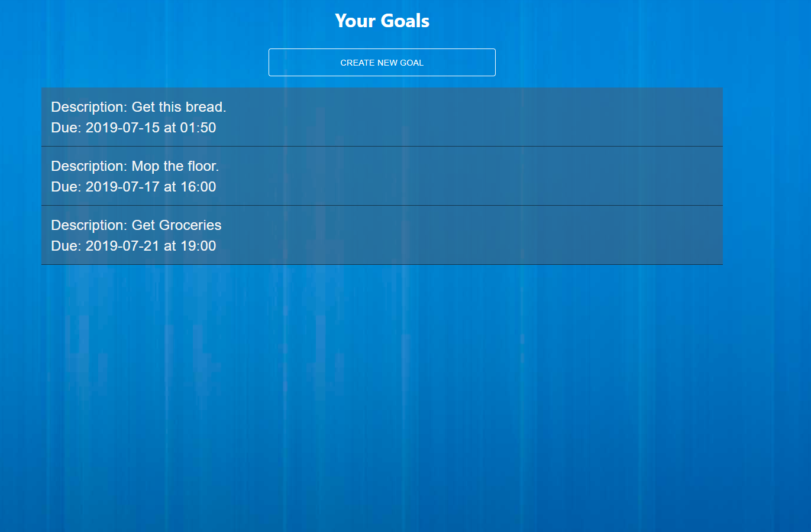
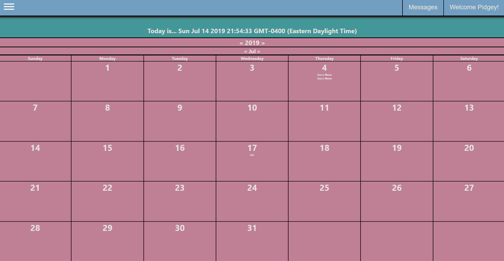
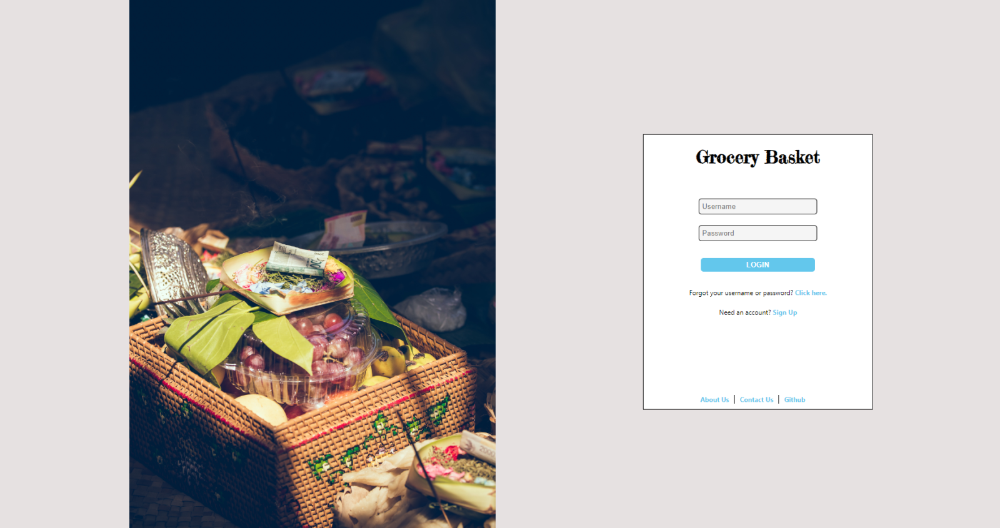
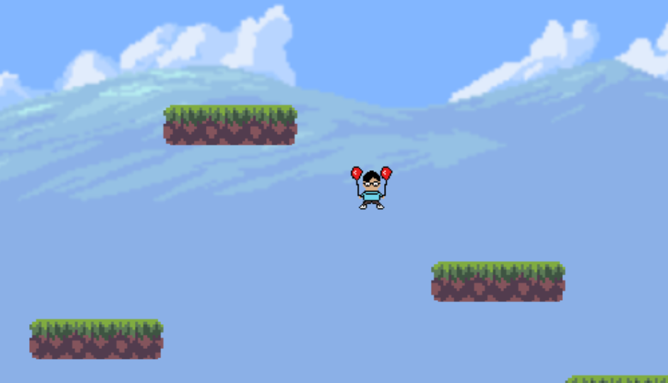

Here are a few projects that I am currently working on or completed.

## Teamster (in development)

An accountability partner app - meet people and reach your goals.

<a href='https://teamster.jayewe.com' target='_blank'>Live Link</a> | <a href='https://github.com/jwy5140/teamster' target='_blank'>Github Repo</a>

## SimpleCalendar (on hold)

A simple calendar interface - make/schedule events. Currently outdated as my CSS has well developed beyond this. 
Ideally, would like to create a new npm package for calendars in the future.

<a href='https://simplecalendar.jayewe.com' target='_blank'>Live Link</a> | <a href='https://github.com/jwy5140/Simple-Calendar-App' target='_blank'>Github Repo</a>

## Grocery List (in development)

Not much more than a simple landing/login page right now - the idea is to allow uploading of recipe PDFs and automatically creating a grocery list from it.

<a href='https://groceries.jayewe.com' target='_blank'>Live Link</a> | <a href='https://github.com/jwy5140/grocery_list' target='_blank'>Github Repo</a>

## The Tale of Eric (on hold)

A platformer game built using Phaser.

Eric is a new teaching assistant hungry for a promotion - but his troublesome students refuse to shower and stop playing League of Legends. Time to take matters into his own hands.

<a href='https://tale-of-eric.jayewe.com' target='_blank'>Live Link</a> | <a href='https://github.com/jwy5140/eric_proj' target='_blank'>Github Repo</a>