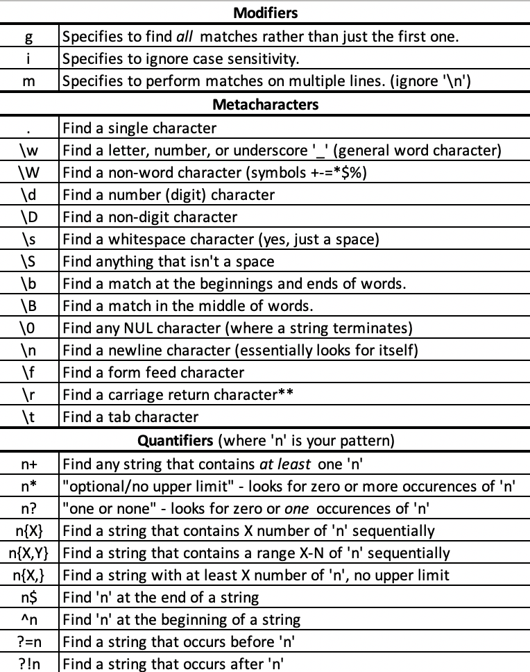

Regular expressions can be an overwhelming concept to the beginner programmer. Although _conceptually easy_ to understand, and having useful resources to reference online, to actually implement regular expressions can be incredibly difficult and confusing. There are many ways to make mistakes here -- and some mistakes may be hard to see.

Regular expressions are tools to match specific patterns in a given string. Think about your general search bar when you press "ctrl + f" in any given program. You can enter letters, numbers, and symbols. You can choose to be general or specific (several letters of a word, or the entire word). The search bar will look for what you enter, and show you where the results are. 

To illustrate how difficult searches can get, think of if you were searching for the word "where" in your favorite book, which is 445 pages. You need to find out how many times the word appears in the book. Thankfully, you have a PDF, so you think you can just use "ctrl + f" to find out instantly! However, the editor has not gone through it, so it is possible that "where" also occurs in the book with typos. Suddenly, it is a daunting task…

With a regular expression, the task could be made quite simple! Take a look at the below example code, written to make sure that users create a correctly formatted password for their accounts on any website.

```javascript
function validate(password) {

    return /(?=.*[A-Z](?=.*[\d])(?=.*[a-z])(?!.*[\W])^.{6,}$/.test(password));
}
```

_A function containing a Regular Expression in Javascript.The above function is in JavaScript. Note that the actual regular expression is contained in the forward-slashes, like "/**your-regex-here**/"._

Lets break it down:
* **"?="** is called a positive look-ahead. This is a quantifier, and basically looks for a match at any point in the input, and is used here to ensure that the other portions of the regular expression are also checked. Without positive look-aheads, in our specific code, if a number came before a capital letter, that number would not be considered a match. Later in the regular expression, we encounter "?!", or a negative look-ahead. This does the opposite of a positive look-ahead, making sure that there are no matches while avoiding returning a value. We will get more into these later. 
* **"."** is a regular expression metacharacter. It means single-character and in this case, is the part of the regular expression that stipulates 
"at least one uppercase".
* **"*"** is a regular expression quantifier. In this case, it stipulates to search the entire input. 
* **"[ ]"** contains what we are searching for. For example, in the case of 
* **"[A-Z]"**, it means to search through for any capital letters. You may also enter metacharacters here. For example, entering "\d" in the example above searches for any digit. Entering "\W" searches for any non-word character.
* **"^.{6,}$"** checks that at least 6 characters exist, with no upper limit. Notice the comma without another number after it - normally our upper limit would go there. 
A minimum of 6 characters, with a maximum of 12, for example, would look like {6,12}.
* The **parentheses** specify a group. They allow you to apply, for example, quantifiers to a specific portion of your regular expression. 

Altogether, our regular expression is saying to: 
* Check all characters and make sure there is at least one uppercase letter.  
**Done by: (?=.*[A-Z])**
* Check all characters and make sure there is at least one lowercase letter.  
**Done by: (?=.*[a-z])**
* Check all characters and make sure there is at least one number.   
**Done by: (?=.*[\d])**
* Check all characters and make sure there are no symbols.  
**Done by: (?!.*[\W])**
* Make sure there are at least 6 characters.   
**Done by: ^.{6,}$**

I'm sure you have encountered account creation forms that ask for passwords fitting specific requirements. Now you know how they can be tested! As you can see, regular expressions are incredibly versatile with capability to be as specific or vague as needed. There are many more ways to specify the result that you want.  
Below is a small collection applicable to JavaScript:

_In Windows, pressing 'return' generates '\r\n', in Linux and Unix, only '\n' is generated._

## Differences in functionality between languages
Although regular expressions are easily distinguishable by their syntax, there are differences between their application in different languages. For example, JavaScript and C++ do not have regular expression conditionals, whereas Ruby does. This can significantly change how a regular expression is written to solve a specific problem. For example, in Ruby, one might write something like:

```ruby
tel = "123-456-7890".match /^(1-)?(?(1)\d{3}-|(\d{3}-)?)\d{3}-\d{4}/
```

As a method of trying to match phone numbers in two different 
formats - including country code and area code, and not including.  
The above regular expression can be broken down like so: IF the string begins with '1-', then look for any three digits preceding a '-', and then match the rest of the phone number. If '1-' does not appear in the string, then only look for the seven final digits. 
This is rather easy in Ruby, but in JavaScript and C++, it needs to be approached differently. You may need to use look-arounds, or even create separate conditional statements outside of regular expressions. 
## Possible Problems
A problem that can arise in regular expressions is catastrophic backtracking. This generally occurs when there is nesting in the regular expression. For example, ignoring the fact that such a regular expression would never actually be used, if provided the right input to test, something similar to the following can result in billions of matches: (([a-z][A-Z])+)*. This is because there are two different ways for the regular expression to match with each input. Regular expressions can even be used in attacks known as ReDoS, which utilize the time-complexity of regular expressions. I suggest looking up "evil regexes" to learn more.

Hope this serves as a good introduction! We'll look at regex more in-depth in a future post.