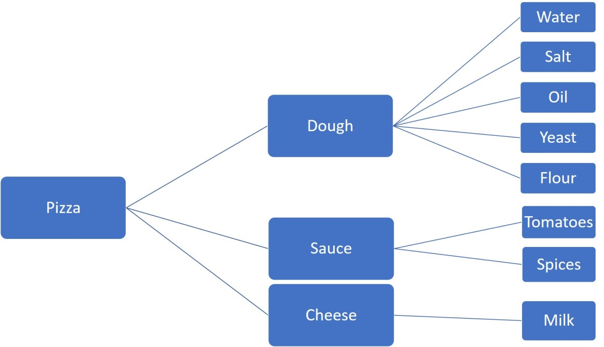

Today, we're going to take a quick look at what's happening under the hood with React.  

The reason for this blogpost is because I was recently presented with this question as part of a technical interview.

To be straightforward - I didn't feel completely prepared to answer the question. This didn't feel good. Having experienced an education in engineering, I've been conditioned to know the why, before knowing the how. (I'm still having PTSD from you, PDEs.) After speaking with several friends of mine with more experience in the field, they too, were unable to produce an answer. It seemed strange, but I suppose we all took React a bit for granted. These days, documentation for the many frameworks we have really don't get into the grit of things. They work more like Ikea manuals - use this function here, and pass these arguments to it. To truly understand, one has to dive into the underlying code.  

However, lets save that for another day :) 

For now, we will just discuss the purpose and benefits of the virtual DOM.

## Document Object Model

Lets take a quick look at what the DOM, or _Document Object Model_ is, and how it works. 
After all, we need to understand what is being improved to see how something else is an improvement. 

Thinking about the name itself - we see 'Object'. Hmm. That's familiar to us. 
When we think about an object in programming, at it's most simplistic level, we think keys and values. 
Lets look at an example object. A pizza, and it's ingredients.

```javascript
const pizza = new Object

pizza.ingredients = {
    "dough",
    "sauce",
    "cheese",
    "toppings",
}

```
<br/>

Those ingredients listed can be further broken down. Lets do that.

```javascript
pizza.ingredients.dough = {
    "flour",
    "water",
    "yeast",
    "salt",
    "oil",
}

//and so on...

```
<br/>
To save time, lets take a look visually:



Well, it turns out, you can think of the DOM in sort of the same way. Lets say you have a element. A div for example.
That div may have attributes such as an id, a class, or a name. Thinking of this in pizza terms, it would be like how oil can be olive oil or canola oil. In the end, it's still oil.
Then, just like this 'upper level' ingredient has it's own ingredients, the div also has children. 

Lets assume our div has an h1-tag as a child. It also has a ul-tag child component. 
Here is a visual representation of how the div could be completely structured:

```html
<div className='list-wrapper'>
    <h1 className='list-header'>Header</h1>
    <ul name='example-list'>
        <li>List Item 1</li>
        <li>List Item 2</li>
        <li>List Item 3</li>
    </ul>
</div>
```

You can see how it forms the same kind of tree as our example pizza-tree up above. 
To further solidify this 'object' model, we can represent this like so:

```javascript
const body = {
    "children" = {
        "div" = {
            "class" = "list-wrapper",
            "children" = {
                "h1" = {
                    "class" = "list-header",
                    "innerHTML" = "Header"
                },
                "ul" = {
                    "name" = "example-list",
                    "children" = {
                        "li" = {
                            "innerHTML" = "List Item 1"
                        },
                        "li" = {
                            "innerHTML" = "List Item 2"
                        },
                        "li" = {
                            "innerHTML" = "List Item 3" 
                        }    
                    }
                }
            }
        }
    }
}
```
<br/>

It looks pretty convoluted when represented this way, but it's fairly simple to understand. 

## The Benefits of the Virtual DOM

But now that we have a picture of the DOM structure in our head, why exactly is the virtual DOM an improvement?
After all, if you think about what we return from our components in React, the virtual DOM is basically an object/tree of HTML elements - just like how we picture the actual DOM. 
Well, it turns out, that the difference is mainly in how updates are managed. 

It makes sense that updating needs to be an optimized procedure. Think about how many updates occur on your average webpage. 
Entering values into a form, opening a dropdown list, or loading more elements of a list are just a few examples.

Many applications built in React are _Single Page Applications_. Can you imagine the amount of updates that is? It would be _incredibly slow_ if these were performed on just the regular DOM. The reason for this is because the regular DOM updates a bit randomly, believe it or not. What happens is that the regular DOM performs **dirty checking**. That is, it checks components at a regular interval to see if it needs to be updated. That could be A LOT of unnecessary checking. Think about, for example, if you had no access to debugging tools while you were coding. Lets say you didn't even get error messages. You can only imagine the frustration of crawling through every line of code at the end of the day. Instead of that nightmare, you can just where the error messages tell you. 


