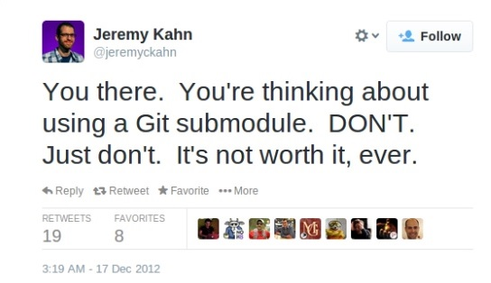

A useful way to separate both organizational projects and personal projects is through the usage of git **submodules** and git **subtrees**.  

Submodules and subtrees are used to separate/distribute code within projects. 

For example, in the case of an organization, there may be a specific project holding code which is reused throughout various other projects.
In this case, instead of hard copying the code into each project, you can instead create subtrees and submodules.
This can help if that reused code is updated in some way. In that case, if the code was hard-copied, updating it in every project can be a pain.  

I am personally using submodules and subtrees as a method of separating the backends and frontends for my projects (a personal preference). 
This way, when I want to share or showcase the project, I can just reference a single link, which is cleaner. 

In this post, we will go over some of the basics of using submodules and subtrees.

## What are the differences between the two?

An important thing to note is that while the use cases for submodules and subtrees may seem quite similar, actually using them is **very different**. 
If you are looking at submodules and subtrees for the first time, it's important to remember these core differences. 
An incorrect assumption may very well lead to quite a bit of confusion.

### Submodules are pointers. | Subtrees are copies.

This is really the **overlying reason for all of the other differences**.  

While a submodule will basically just **create a link from the parent directory to another git repo**, a subtree will actually **copy that repo into the parent directory**. In fact, if you go to github, and look at a project directory containing a submodule, you will see something like this:


_Note the .gitsubmodules file - we'll explain this later._

Hmm, that's a bit of a weird folder name. What does the '@' represent? Actually - that's yet another difference between submodules and subtrees...

### Submodules are for specific commits. | Subtrees use the latest commit.

While subtrees will use the latest commit of a project, submodules use a specific commit. 
As you can see, the name of the submodule even displays with identification for which commit it is, indicated by the code after '@'. 
Meanwhile, a subtree will simply display the directory name for the subtree.

An important result of submodules being pointers and subtrees being copies manifests in the consensus that **submodules are harder to pull**, while **subtrees are harder to push**.
Think about it - you can't really pull a pointer. So what do we do? What if we need to clone? We'll answer these questions and elaborate later! :) 

### Submodules are not straightforward to clone | Subtrees are easy to clone

If an unsuspecting user decides to clone a project of yours which uses submodules, we have bad news for you! Submodules do not automatically clone when the parent project is cloned!
The submodules for a project are only cloned when the **--recursive** flag is added to the git clone command. If your project is likely to be cloned by beginners with no knowledge of submodules, or the url to clone your project is provided at a location other than github, I would suggest to specify needing to use the --recursive flag when cloning your project.

As for subtrees...you can just clone the project normally, and all subtrees will also be cloned. 

## Using Submodules

### Adding a Submodule

To add a submodule to your project, run:

```bash
$ git submodule add git@github.com/username/repo.git
```
<br/>

This will create a new folder in your current directory, with the actual name of the repo as the name of the folder. 
If it is your first time adding a submodule to the project, then an additional file will also be created - the .gitmodules file.
Inside, you will see something like this:

```bash
[submodule "Name of Submodule"]
	path = path/to/submodule
	url = git@github.com:username/repo.git
```
<br/>

This file tracks the submodules included in your project. Whenever you add a new submodule, it will also be added here. 
The formatting is quite straightforward. A few things to note are that the **path must not end with a '/'**, and that the url may be any path which would work with git clone.
Here, you are also able to specify a branch of the submodule. However - this is optional. 

### Pulling a Submodule

At a basic level, pulling a submodule is like pulling any other project. You first cd into the submodule directory, then run git pull. 
However, there is actually another option which helps to simplify pulling submodules (especially if there are many in a project).
You can run:

```bash
$ git submodule update --remote
```
<br/>

_Note: you will need to run 'git submodule init' once before any updates._

You are also able to add other flags than '--remote' to this command.  

One of particular note is '--recursive'.
If you are familiar with recursion in coding, then you should have an idea of what '--recursive' does.
It updates all of the submodules in your project, and then also checks those submodules to see if they also contain submodules to update, and so on.

### Pushing a Submodule

Pushing to a submodule is slightly similar to pulling. One option is to go into every changed submodule directory, and push them all individually. 
Or, the slightly easier option is to use the following command:

```bash
$ git push --recurse-submodules=on-demand
```

The above --recurse-submodules command can take several arguments. For example, the 'check' argument would be used in a situation where you want to only push if no submodules need to be pushed (pushing the parent directory first would cause issues). In this case, the 'on-demand' argument would automatically push any submodules that need to be pushed first, before pushing the parent.

## Subtrees

### Adding a Subtree

To add a subtree to your project, run: 

```bash
$ git subtree add --prefix=path_of_directory git@github.com:username/repo.git
```

_The prefix would be the name of the new directory containing the subtree, and can be specified as nested in a subdirectory_

Looks quite similar to adding a submodule! You may also specify a branch here, as well as add additional flags. 
One such flag (and an important one at that) is '--squash'. When you add a subtree, you normally also get every commit that comes with that subtree. 
This can be annoying and unnecessary. The '--squash' flag simply 'squashes' all of those commits into a single commit. 

### Pulling a Subtree

To pull from a subtree's remote, you simply use the same command above, except you replace 'add' with 'pull'.

```bash
$ git subtree pull --prefix=path_of_directory git@github.com:username/repo.git
```
<br/>

Easy to remember, right? That being said, it can still be rather annoying to type all of this out.
Ways to simplify this would be to add the subtrees as remotes (to avoid using entire urls) or my personal recommendation - **automate with a script**. 

### Pushing a Subtree

Can you guess how to push to a subtree's remote?  

If you guessed that we would simply change 'pull' to 'push' in the above - you're right!

```bash
$ git subtree push --prefix=path_of_directory git@github.com:username/repo.git master
```
<br/>

However, then why is it considered that pushing to a subtree's remote is difficult?

Well, the answer lies in what happens when you push to a subtree's remote.
When you push to a subtree's remote, it _rebuilds all of the past commits for the subtree_.
As you can imagine, this can take quite a while, and is something that many complain about. 

## Conclusion

This is all that we will touch on today regarding git submodules and subtrees. 
These are powerful tools of organization in what could be a chaotic codebase, each with their individual uses. 

Many people are quite against usage of submodules, and strongly advocate the usage of subtrees.
In fact, when first scouring for information regarding submodules, I saw references to submodules as 'sobmodules', and even found this little gem of a tweet: 



However, when it comes to your own projects, it is up to you whether you want to use one or the other.