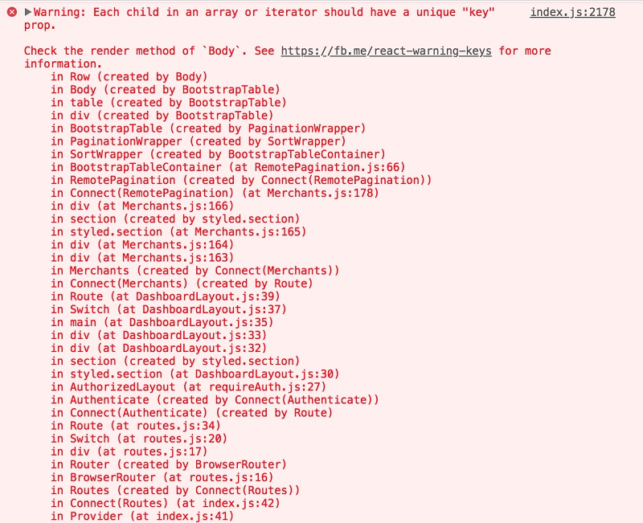
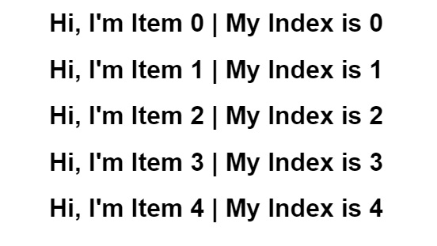
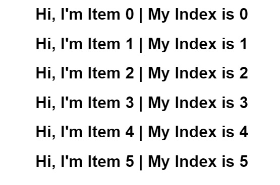
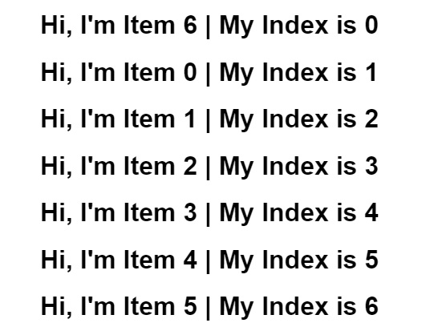

If you are learning React, or when you were learning React, you probably got pretty well acquainted with this error message:



Don't worry. We've all been there.  

The next thing that most of us probably did was something like this:

```javascript
arr.map((item, index)=>{
    return <li key={item.index}>{item.name}</li>
})
```
<br/>

Well, or at least that's what my intuition told me to do. I promptly learned that this was generally bad practice after strange errors started happening. 
However, I wasn't told _why_ it was bad practice. In fact, by this point, I didn't even know what the purpose of the key was! It was time for research.

## What does the key in React do?

What do we know about keys so far? We know that we are given a warning when we create list elements without the key attribute.
We've also been told that it is bad practice if we set the key attribute to the index of the element.
Just from these two facts alone, we can say that keys are related to lists, and guess that keys are related to the ordering of lists.

As it turns out, the key is used by React to track list item positions and changes for DOM updating. 
Think of it as React's 'id' for the item. In databases, we know that the 'primary key' is generally the id for an entry - a unique identifier.
Here, the key generally also needs to be a unique identifier, so that React is able to _always_ recognize which item it is looking at.

If you've read my [previous article about the virtual DOM in React](https://jayewe.com/the-significance-of-the-virtual-DOM/), then you know how React updates the DOM.
React uses the virtual DOM to check which components have changed, and then **only updates those elements on the real DOM**.
This is the reason behind the importance of React being able to recognize which list items are which. 
If it checks a specific list item, and sees that no changes have been made, then it doesn't need to rebuild that element. 

## Why is using an array index as a key considered bad practice?

To understand this, lets take a more visual look at what using an index as a key does.

Consider the following:

```javascript
  const [examples, setExamples] = useState([
    "Hi, I'm Item 0",
    "Hi, I'm Item 1",
    "Hi, I'm Item 2",
    "Hi, I'm Item 3",
    "Hi, I'm Item 4"
  ]);

    const demolist = () => {
    return examples.map((item, index) => {
      return (
        <li key={index}>
          <h1>{item + ` | My Index is ${index}`}</h1>
        </li>
      );
    });
  };
```
<br/>

Here, demolist would create a list of items that looks like this:



If we add an item to the end of the list, the list would change to look like this:



Well, no problem there. That's completely fine! 

The problem arises in if we add an item, but add that item to **anywhere else** in the array.
I'm sure you can see what's coming.



See the issue?
If we add a new item to the list at **any position but the end**, the indexes don't follow. 
It's something that has never mattered before, but here, if you set the key of the list item to its corresponding array index, it matters.
In the case of the above, React would not be able to recognize any of the list items, and think that it needs to rebuild every single one. 

This not only occurs when items are added, but also when there is any sorting. There would be degredation of performance. 

However, one needs to recognize that there are times when avoiding the usage of index as a key is negligible or nonexistant. 
If the list that you are building is just that - a simple list that you intend to show to visitors of your application or website, then you may go ahead and use indexes as keys.
In fact, in the case of the simple text list about, I personally was unable to notice any performance issues when add items to the list, or sorting the list. 
The issue would likely be most pronounced if creating a list with CSS effects, or anything involving larger file sizes. 

As a matter of fact, if no key at all is provided to your list components, React actually **defaults** to using the index as the key. 
This is also why no formal warning is displayed when using index as key - you can absolutely do it! You just need to know when.

TLDR; Feel free to use index as key when you have a static list - use a unique ID when your list is dynamic.
