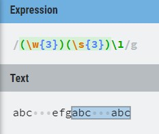
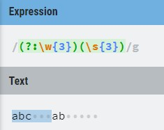
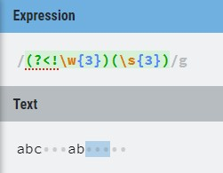

Today, we will be taking a more in-depth look at the very interesting topic of regular expressions! 

_If you missed my introductory blogpost on regular expressions, you can find it [here](https://jayewe.com/introduction-to-regular-expressions/)._

Specifically, we'll be taking a quick look at capturing groups. (So we'll be working a lot with parentheses!)

## What are Capturing Groups?

A capturing group is any part of a regular expression that is encapsulated by parentheses. They are numbered from first-to-last. 
Thus, in this case:

```javascript
const rgx = /(\w{3})(\s{3})/g
```  
<br/> 

There are **two** capturing groups. 
Capturing group 1 is looking for 3 word characters in a row. 
Capturing group two is looking for three whitespace characters in a row.

To specify that a group is **non-capturing**, '?:' needs to precede the characters within the parentheses. 
For example, to change the previous example to have only one capturing group of 3 whitespace characters, you would modify it like so:

```javascript
const rgx = /(?:\w{3})(\s{3})/g
```  
<br/> 

To easily reference any capturing group at another point in your regular expression, you can simply reference by using a backslash, and a capturing group number.

In our first example, the first capturing group is 3 word characters, so if we expect 3 word characters again, we can simply write '\1' at another point in the regular expression!

```javascript
const rgx = /(\w{3})\1(\s{3})/g

// OR, AFTER THE THREE WHITESPACE CHARACTERS

const rgx = /(\w{3})(\s{3})\1/g
```  
<br/> 

Similarly, to reference the capturing group of 3 whitespace characters, you just need to write '\2'.

So to repeat the entire regular expression again, you can write:

```javascript
const rgx = /(\w{3})(\s{3})\1\2/g

// OR, IF YOU WANT TO SIMPLIFY 
// YOU CAN EVEN MAKE THE ENTIRE ORIGINAL REGULAR EXPRESSION ONE CAPTURING GROUP

const rgx = /(\w{3}\s{3})\1/g
```  
<br/> 

If there are non-capturing groups included, this simply affects if we are to reference any capturing groups later in the regular expression.

In the above, we reference capturing group 1 and 2 with '\1' and '\2' respectively.
However, if we return to the regex where we have a noncapturing group like so:

```javascript
const rgx = /(?:\w{3})(\s{3})/g
```  
<br/> 

Then our only option to reference a capturing group becomes '\1', which references the capturing group of 3 whitespace characters. 

## Gotchas!

While capturing groups in general are not incredibly complicated, there are a few things that I wish I had explained to me when I first took a look at them.

**1. Referencing Capturing Groups Looks for EXACT matches**

What this means is that if you use the following regular expression: 

```javascript
const rgx = /(\w{3})(\s{3})\1/g
```  
<br/> 

...and the first capturing group (3 word characters) captures "abc", then the reference will also SPECIFICALLY LOOK FOR "abc" after 3 whitespace characters.

Have a look for yourself:



The text that is captured is highlighted in the above. 
As you can see, 'abc   efg' is **skipped** because the reference to the first capturing group is looking for another occurance of 'abc'!

**2. Non-Capturing Groups are NOT Excluded From Results**

When I first found out about non-capturing groups, my intuition lead me to believe that using one would mean that the regular expression would avoid occurances of the non-capturing group in results.
This is easier to explain with an example - consider the following:

```javascript
const rgx = /(?:\w{3})(\s{3})/g
```  
<br/> 

I believed that this meant the regular expression would look for all occurances of 3 whitespace characters WITHOUT 3 word characters preceding them. 
Nope! The 3 word characters get matched anyway! 



**A non-capturing group still gets matched and returned, the main difference is that they are excluded when referencing any previous capturing groups with '\1', et cetera.**

In the case where you would, for example, want to exclude any occurances of 3 whitespace characters following or preceding 3 word characters, what you would like to use
are **negative look-arounds**.

As a quick demonstration, to only match 3 whitespace characters WITHOUT 3 preceding word characters, you would use a negative look-behind:

```javascript
const rgx = /(?<!\w{3})(\s{3})/g
```
<br/>

The results being:



...but we'll take a closer look at that another time! 

If you would like to practice your regular expressions, I would suggest using the website [RegExr](https://regexr.com/). 
It is an excellent resource, allowing you to input regular expressions and test against your own text. 
It also offers explanations for matches, and real-time updating of matches as you change your regular expression!